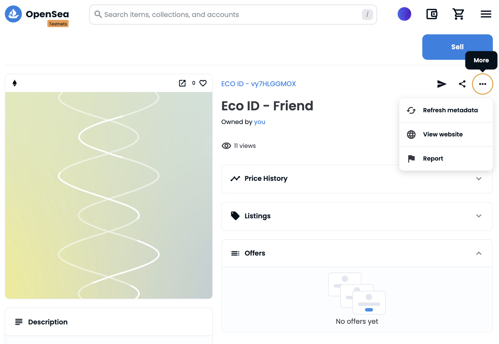
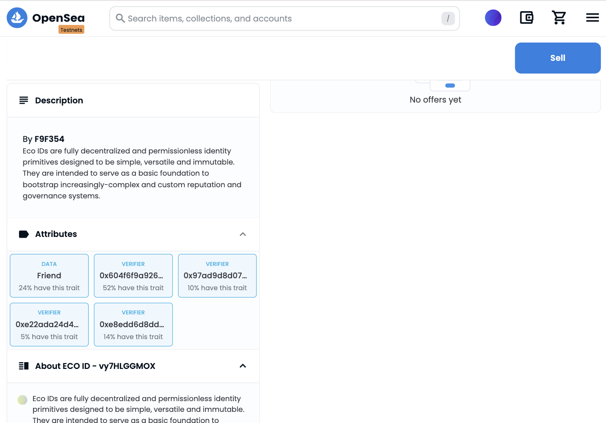

# How Eco ID protocol works

> Eco IDs are non-transferable NFTs that conform to the ERC-721 standard. Each NFT contains an arbitrary claim that is attested to by at least one verifier, along with a list of the verifiers who have attested to the claim. The claim can contain any piece of data an individual or collective might want to be associated with a public Ethereum address.

There are different types of actors in the Eco ID system, and anyone can serve as any of these actors:

* 🔎 Verifiers attest on-chain to certain data points about Receivers
* 📩 Receivers request attestations from Verifiers
* 🎁Third Party can call the Register and/or Mint methods and pay the gaz fees for someone
* Readers consume the attestations about Receivers for their own purposes

Different types of actors means also different ways to interact with Eco ID protocol :

1. 🔎 You can create an attestation with your signature, to certify and associate data, and competencies or attribute a subscription to someone (Verifier to Receiver)
2. 📩You can attest the information Verifier claims in an attestation by signing the same attestation. Once the attestation contains both signatures, your Eco ID is ready to be registered and minted.&#x20;
3. Once your Eco ID is ready to be registered and minted, you can do it yourself (Receiver) or ask someone to do it for you (Third Party). This will call two different methods :&#x20;

* **register method**:  link the new attestation data to the Eco ID, this doesn't appear on the Eco ID until it's minted for the first time. \
  When an Eco ID in minted once, new attestations containing the same claim only need to be registered (no need to mint them). An attestation containing the same data (same Verifier, Receiver, and Claim) can be registered only once. After every register, a new Verifier will appear on the Eco ID
* **mint method**: after an attestation containing a specific claim is registered for the first time, the Eco ID needs to be minted once si it will contain the new claim.&#x20;

Example : \
\
For the Claim "Friend" once you've minted your Eco ID once, the new Verifier will appears after the register, every time you register a new attestation. You need to "Refresh metadata" to see the new Verifier attestation.

<figure><figcaption>
Refresh metadata to see attestations newly registered
</figcaption></figure>

<figure><figcaption>
New registered attestations appear under "Attributes" as "VERIFIER"
</figcaption></figure>

\
\

